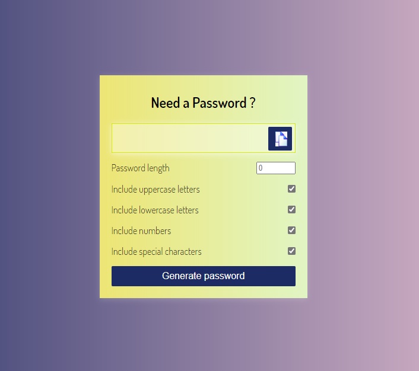

# Password-Generator
A simple Password Generator created using Vanilla JavaScript, HTML and CSS

## Password Generator Image

## How to use it
Users can select -
* Length of password (between 4 and 20)
* Are uppercase letters needed?
* Are lowercase letters needed?
* Are numbers letters needed?
* Are special characters letters needed?

To generate password, simply click the 'Generate password' button.
Password generated can be copied to clipboard using the copy button.
